# MyTask

AI-powered, permissionless task marketplace built on x402 protocol with four-party economic model.

## Architecture Overview

```mermaid
flowchart TB
    subgraph Users["👥 Four Roles"]
        S[("🎯 Sponsor<br/>Task Publisher")]
        T[("⚡ Taskor<br/>Task Executor")]
        P[("📦 Supplier<br/>Resource Provider")]
        J[("⚖️ Jury<br/>Validator")]
    end

    subgraph Agents["🤖 AI Agent Layer"]
        SA["Sponsor Agent<br/>Budget Optimization"]
        TA["Taskor Agent<br/>Task Matching"]
        PA["Supplier Agent<br/>Pricing Strategy"]
        JA["Jury Agent<br/>Evidence Analysis"]
    end

    subgraph Chain["⛓️ On-Chain Layer"]
        ESC["Escrow Contract<br/>Fund Management"]
        JURY["Jury Contract<br/>Stake & Vote"]
        X402["x402 Middleware<br/>Payment Protocol"]
    end

    subgraph Flow["📋 Task Lifecycle"]
        F1["1. Create Task"]
        F2["2. Accept & Execute"]
        F3["3. Submit Evidence"]
        F4["4. Jury Validation"]
        F5["5. Settlement"]
    end

    S --> SA
    T --> TA
    P --> PA
    J --> JA

    SA <-->|"Negotiate"| TA
    TA <-->|"Request"| PA
    PA <-->|"Verify"| JA

    SA --> ESC
    TA --> X402
    PA --> X402
    JA --> JURY

    F1 --> F2 --> F3 --> F4 --> F5
    ESC -.->|"Lock Funds"| F1
    X402 -.->|"Gasless Pay"| F2
    JURY -.->|"Consensus"| F4
    ESC -.->|"Distribute"| F5
```



## Four-Party Economic Model

| Role | Responsibility | AI Agent Function | Incentive |
|------|----------------|-------------------|-----------|
| **Sponsor** | Create & fund tasks | Budget optimization, risk assessment | Task completion value |
| **Taskor** | Execute tasks | Task matching, execution planning | Task reward (70%) |
| **Supplier** | Provide resources | Dynamic pricing, inventory management | Resource fee (20%) |
| **Jury** | Validate completion | Evidence analysis, consensus voting | Validation fee (10%) |

## Core Features

- **AI-Driven Automation**: Each role has an autonomous AI agent (LangGraph-based)
- **x402 Protocol**: HTTP-native payment with gasless UX via EIP-2612/EIP-712
- **Permissionless**: No gatekeeping; anyone can participate in any role
- **Multi-Token Support**: Any ERC-20 following OpenPNTs protocol
- **On-Chain Settlement**: Transparent escrow with dispute resolution
- **Jury Consensus**: Stake-weighted voting for task validation

## Agent Interaction Flow


## Technology Stack

| Layer | Technology |
|-------|------------|
| Smart Contracts | Solidity (Foundry) |
| AI Agents | LangGraph + LLM (OpenAI/DeepSeek) |
| Payment Protocol | x402 + EIP-2612 (Gasless) |
| Identity | ERC-8004 Validation Registry |

## Project Structure

```
MyTask/
├── contracts/           # Foundry smart contracts
│   ├── src/
│   │   ├── JuryContract.sol
│   │   └── interfaces/
│   ├── test/
│   └── lib/forge-std/
├── docs/                # Architecture & analysis
└── submodules/          # Reference implementations
```

## Quick Start

```bash
# Install dependencies
cd contracts && forge install

# Run tests
forge test

# Deploy (local)
forge script script/Deploy.s.sol --rpc-url localhost:8545
```

## Documentation

| Document | Description |
|----------|-------------|
| [Architecture Synthesis](docs/REFERENCE-ARCHITECTURE-SYNTHESIS.md) | Complete system design |
| [Integration Guide](docs/INTEGRATION-QUICK-START.md) | Quick start for developers |
| [ADRs](docs/ARCHITECTURE-DECISION-RECORDS.md) | Key design decisions |
| [PayBot Analysis](docs/PayBot-Core-Abstraction-Analysis.md) | Gasless payment deep-dive |
| [Hubble Integration](docs/HubbleAITrading-Integration-Solution.md) | Multi-agent architecture |

## Inspiration

Built upon research from:
- [Payload Exchange](https://github.com/microchipgnu/payload-exchange) - x402 payment proxy
- [Hubble AI Trading](https://github.com/HubbleVision/hubble-ai-trading) - Multi-agent system
- [PayBot](https://github.com/superposition/paybot) - Gasless middleware
- [Halo](https://github.com/humanlabs-kr/halo) - Decentralized infrastructure

## License

MIT License - Open source and permissionless.
